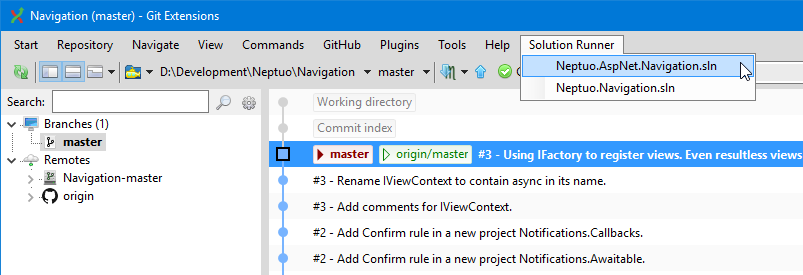

# GitExtensions.SolutionRunner
A Visual Studio solution runner plugin for Git Extensions



## Requirements

- **Git Extensions 6.0.2+**: This plugin is compatible with Git Extensions 6.0.2 and later
- **.NET 9.0 Desktop Runtime**: Required by Git Extensions 6.x ([Download](https://dotnet.microsoft.com/download/dotnet/9.0))

## Installation

Install via the Git Extensions Plugin Manager:
1. Open Git Extensions
2. Go to Tools → Settings → Plugins
3. Click "Plugin Manager"
4. Search for "GitExtensions.SolutionRunner"
5. Click Install

## Compatibility

| Plugin Version | Git Extensions Version | .NET Runtime |
|---------------|------------------------|--------------|
| 9.0.0+        | 6.0.2+                | .NET 9.0     |
| 8.0.x         | 5.x                   | .NET 8.0     |

## Building from Source

```bash
# Prerequisites
- .NET 9.0 SDK or later

# Build
dotnet build src/GitExtensions.SolutionRunner/GitExtensions.SolutionRunner.csproj

# Package
dotnet pack src/GitExtensions.SolutionRunner/GitExtensions.SolutionRunner.csproj
```

## License

See [LICENSE](LICENSE) file for details.
